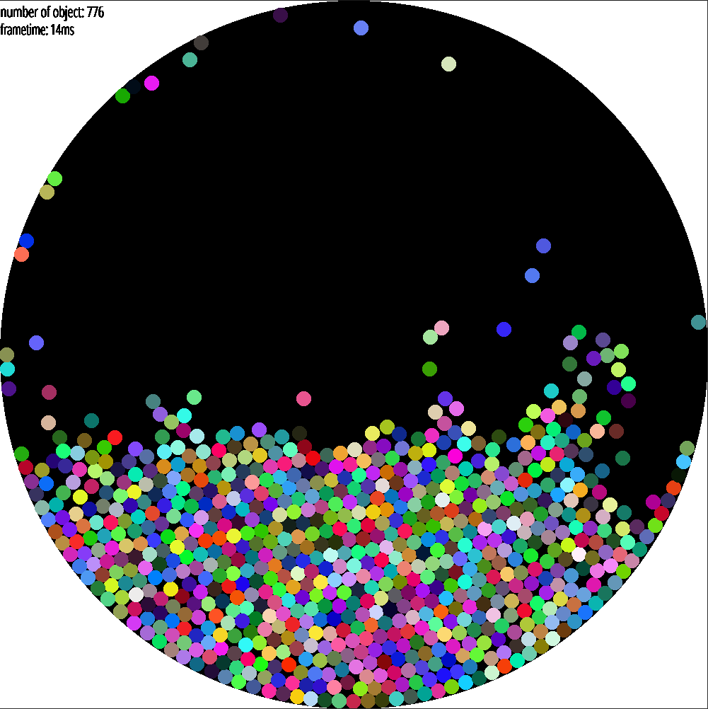
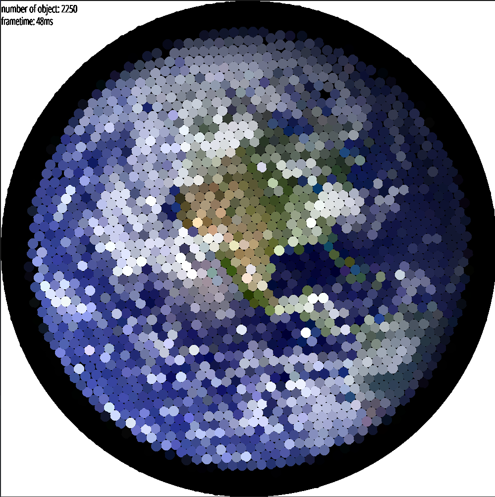
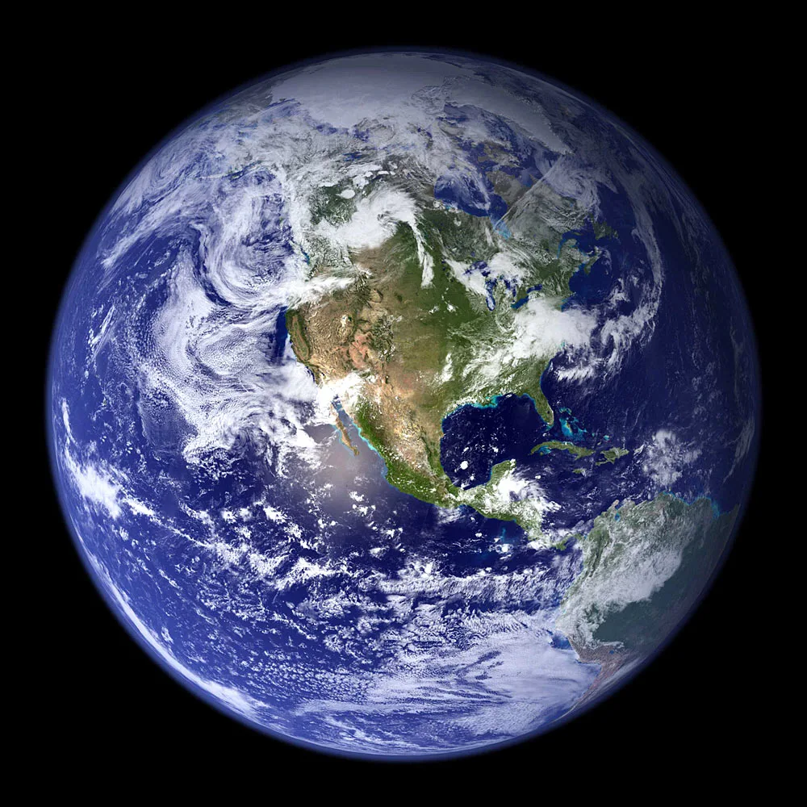

# A simple physics  "engine" made in rust

After watching this video https://www.youtube.com/watch?v=9IULfQH7E90&t=309s
I wanted to make it by myself.

In this project, I implemented the Verlet algorithm and tried to implement 
different broadphase algorithms to make my simulation faster.
I tried bruteforce, uniform grid and quadtree to limit the numbers of comparaison 
I have to do while checking collisions.

I can then generate an image during the simulation using the deterministic 
characteristic of this algorithm.

